# 最適化手法の比較レポート

## 概要

本レポートでは、RLC等価回路パラメータ最適化における7種類の最適化手法の性能を比較・考察する。
各手法はSpiceLibを用いたLTSpiceシミュレーションと連携し、VNA測定データとの誤差を最小化するパラメータ（R, L, C）を探索した。

## 結果サマリー

| 手法 | Final Error | R [Ω] | L [nH] | C [nF] | 評価回数 | 収束性 |
|------|-------------|-------|--------|--------|----------|--------|
| **Nelder-Mead** | **4,744.85** | 0.347 | 22.05 | 4.54 | 503 | ◎ |
| **CMA-ES** | **4,744.85** | 0.347 | 22.05 | 4.54 | 700 | ◎ |
| **Differential Evolution** | **4,744.86** | 0.347 | 22.05 | 4.54 | 2,363 | ○ |
| Bayesian | 5,746.27 | 0.371 | 21.98 | 4.66 | 100 | △ |
| NSGA-II | 52,260.76 | 0.915 | 22.99 | 5.19 | 600 | × |
| L-BFGS-B | 1,628,147.74 | 1.458 | 68.77 | 1.73 | 212 | × |
| PSO | 1,603,399.09 | 1.937 | 7.30 | 14.37 | 3,000 | × |

## 各手法の詳細考察

### 1. Nelder-Mead法（推奨）

**特徴**: 勾配不要の単体法（Simplex法）

**結果**:
- 最小誤差: 4,744.85
- 評価回数: 503回（最少）
- 収束: 安定して大域最適解に到達

#### 収束履歴
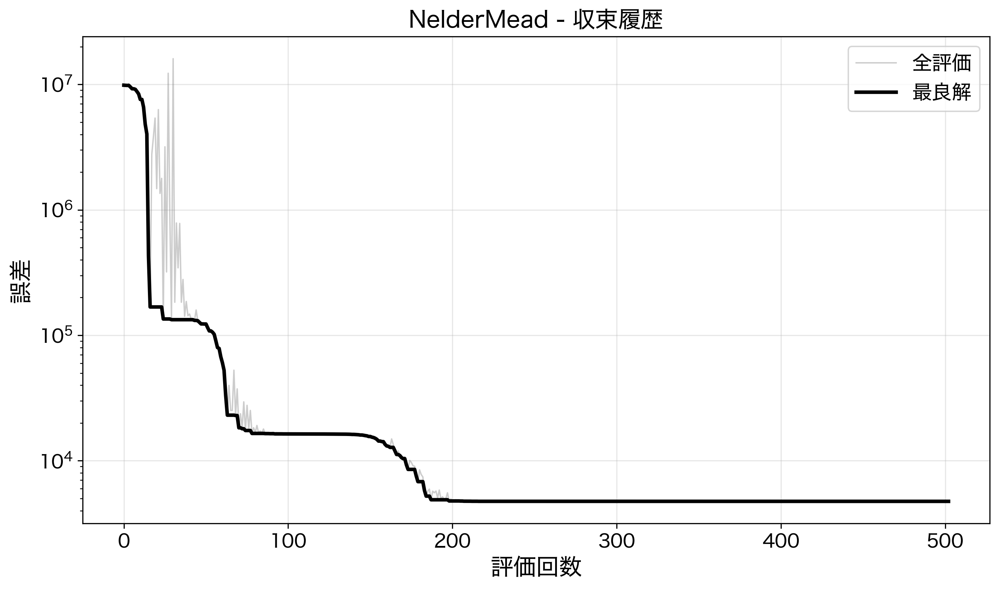

初期値（10^7程度）から約200回の評価で最適解（4,744.85）に収束。収束が非常に速く、503回の評価で安定した解に到達した。

#### インピーダンス比較
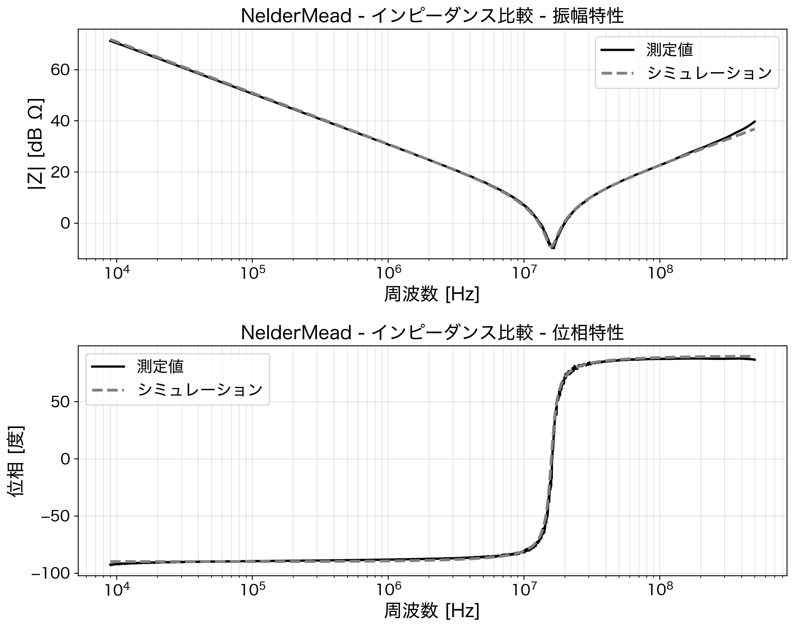

振幅特性・位相特性ともに、測定値（黒実線）とシミュレーション（灰色破線）がほぼ完全に一致している。

**考察**:
- 本問題において最も効率的な手法
- 勾配計算不要のため、シミュレーションベースの最適化に適している
- 初期値依存性があるが、適切な初期値（R=0.1Ω, L=10nH, C=100nF）で良好に収束
- 評価回数が少ないため、計算コストが低い

**推奨度**: ★★★★★

---

### 2. CMA-ES（Covariance Matrix Adaptation Evolution Strategy）

**特徴**: 共分散行列適応を用いた進化戦略

**結果**:
- 最小誤差: 4,744.85（Nelder-Meadと同等）
- 評価回数: 700回
- 収束: 安定して大域最適解に到達

#### 収束履歴
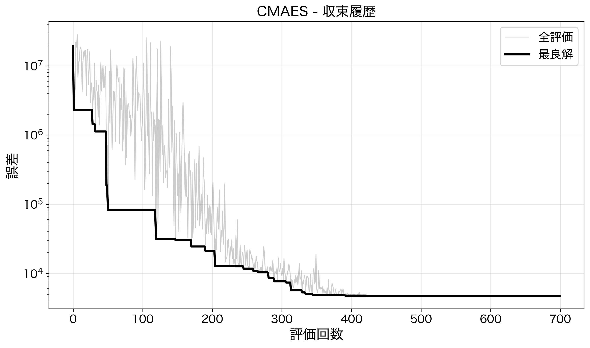

約400回の評価で最適解に収束。灰色の線（全評価）の変動が大きいのは、共分散行列を適応的に更新しながら探索空間を広く探っているため。

#### インピーダンス比較
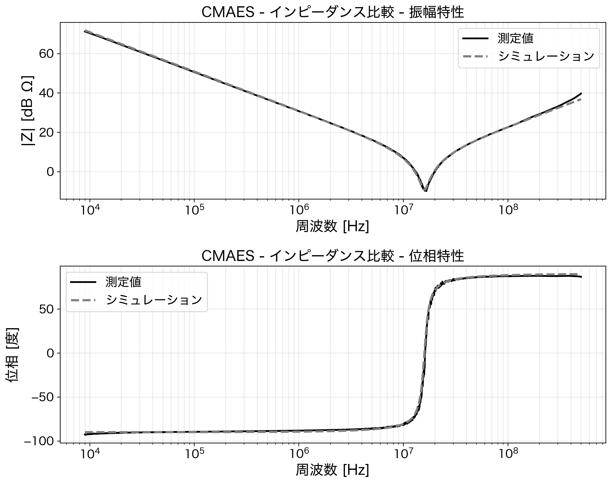

Nelder-Meadと同様に優れたフィッティングを示している。

**考察**:
- Nelder-Meadと同等の最適解に到達
- 共分散行列の適応により、パラメータ間の相関を考慮した探索が可能
- 評価回数はNelder-Meadより多いが、ロバストな探索が期待できる
- 高次元問題への拡張性が高い

**推奨度**: ★★★★☆

---

### 3. 差分進化法（Differential Evolution）

**特徴**: 集団ベースの進化的アルゴリズム

**結果**:
- 最小誤差: 4,744.86（ほぼ最適）
- 評価回数: 2,363回
- 収束: 最終的に最適解に到達するが、収束に時間がかかる

#### 収束履歴
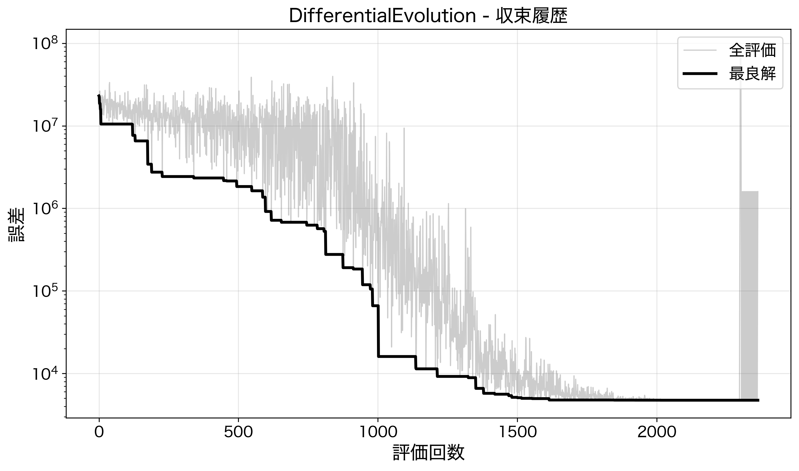

約1,500回の評価で最適解に収束。灰色の線が終盤まで高い値を維持しているのは、集団内の多様性を保ちながら探索している証拠。

#### インピーダンス比較
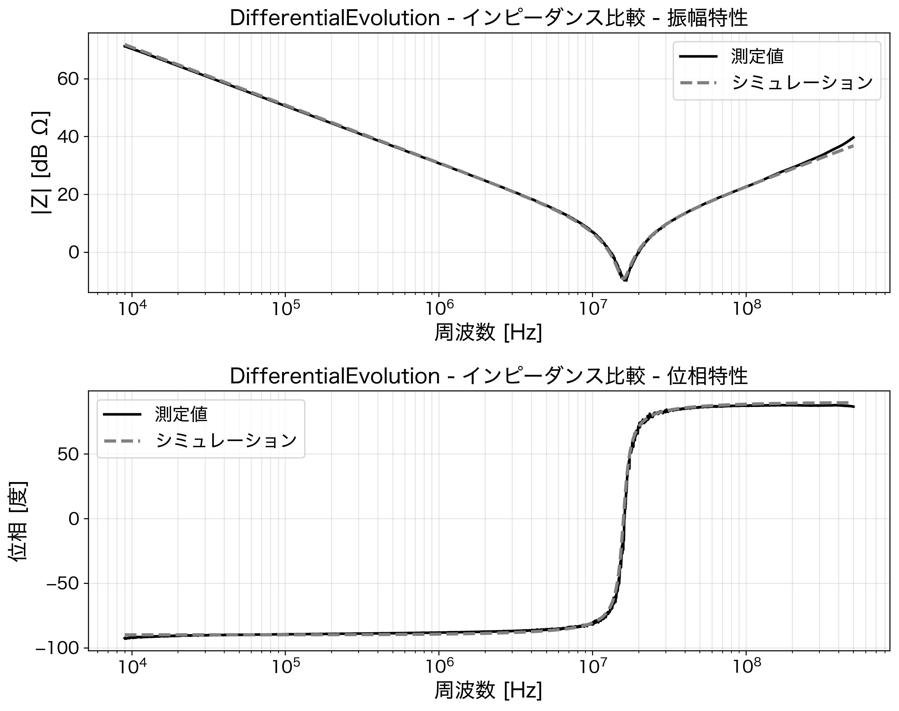

振幅・位相ともに優れたフィッティングで、Nelder-MeadやCMA-ESと同等の結果。

**考察**:
- 大域探索能力が高く、局所解に陥りにくい
- 初期値不要で、探索空間全体を探索
- 収束に多くの評価回数を要する（約2,300回）
- 本問題では過剰なスペックだが、複雑な多峰性問題には有効

**推奨度**: ★★★☆☆

---

### 4. ベイズ最適化（Bayesian Optimization）

**特徴**: ガウス過程による代理モデルを用いた最適化

**結果**:
- 最小誤差: 5,746.27
- 評価回数: 100回（設定値）
- 収束: 最適解に近いが、完全には収束せず

#### 収束履歴
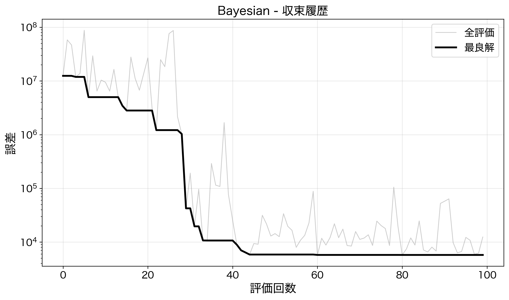

わずか100回の評価でError=5,746まで到達。約40回目で急激に改善し、その後も探索を継続。灰色の線が上下するのは、探索（Exploration）と活用（Exploitation）のバランスを取りながら未知の領域も調べているため。

#### インピーダンス比較
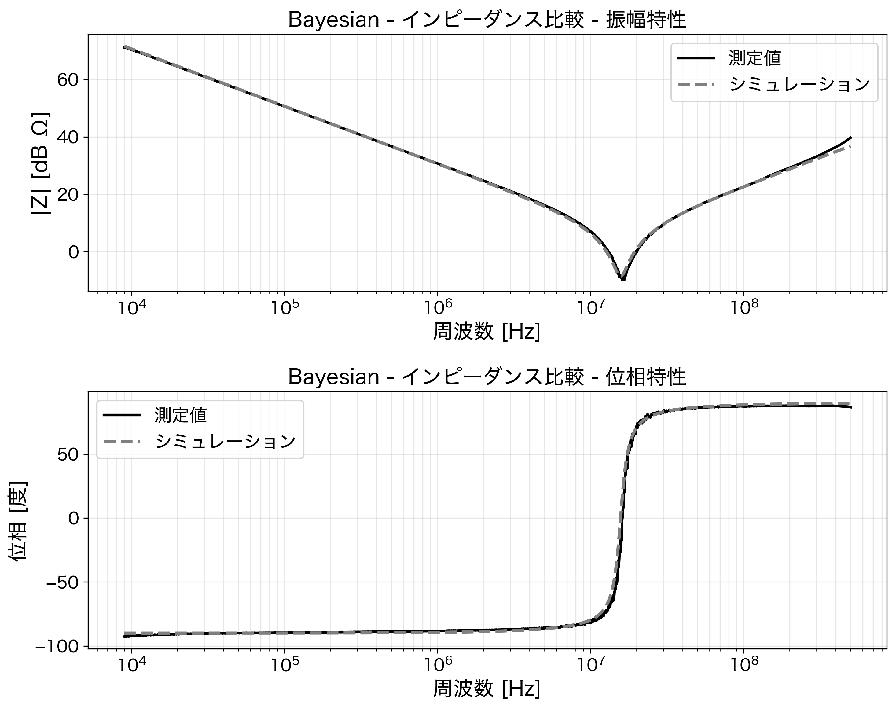

振幅・位相ともに良好なフィッティングだが、最適解と比較すると約20%の誤差がある。

**考察**:
- 評価回数が限られた状況で効率的に探索
- 100回の評価でほぼ良好な解（誤差差約20%）に到達
- シミュレーションコストが高い場合に有効
- 評価回数を増やせばさらなる改善が期待できる
- 対数一様分布での探索空間定義により、桁違いのパラメータ探索に対応

**推奨度**: ★★★☆☆（評価回数制限がある場合に推奨）

---

### 5. NSGA-II（Non-dominated Sorting Genetic Algorithm II）

**特徴**: 多目的最適化アルゴリズム

**結果**:
- 最小誤差: 52,260.76
- 評価回数: 600回
- 収束: 不十分（最適解から約10倍の誤差）

#### 収束履歴
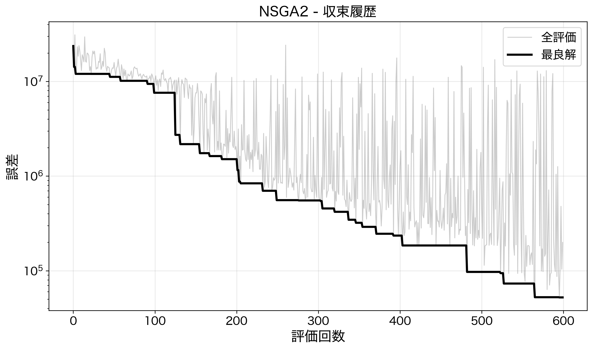

収束が非常に遅く、600回の評価後も10^5程度の誤差に留まっている。灰色の線が終始高い値を維持しているのは、パレートフロントの探索のために集団の多様性を維持しているため。

#### インピーダンス比較
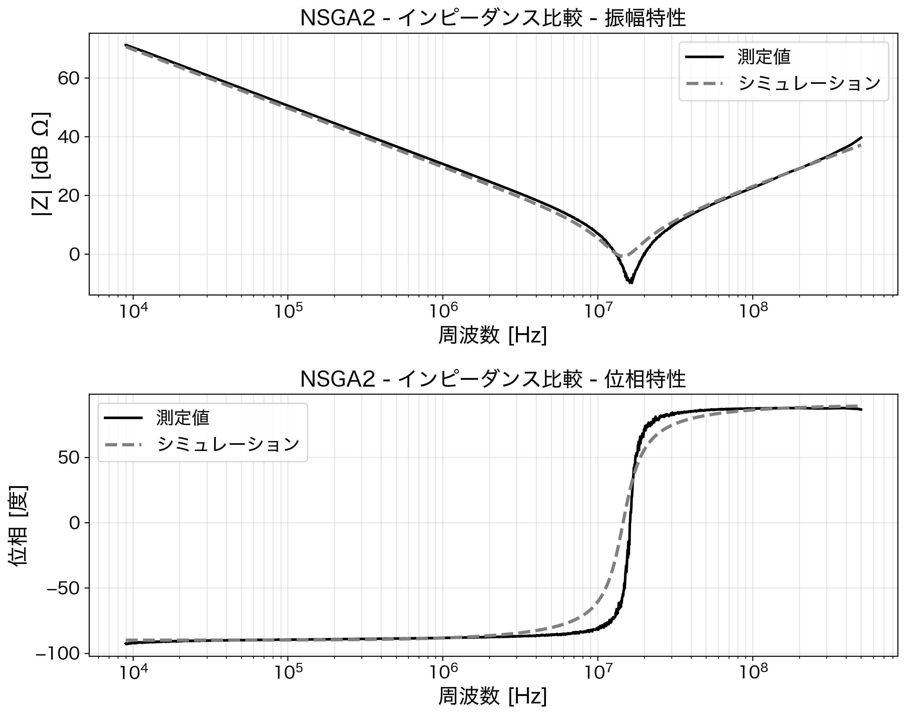

振幅特性は比較的良好だが、位相特性に明確なずれが見られる。特に共振周波数付近（10^7 Hz）で測定値とシミュレーションの乖離が顕著。

**考察**:
- 多目的最適化向けのアルゴリズムを単目的に適用
- 本問題には過剰な機能であり、効率が低下
- 振幅誤差と位相誤差を別目的として最適化する場合には有効
- パレートフロントの探索には適しているが、単一最適解の探索には不向き

**推奨度**: ★★☆☆☆（多目的最適化が必要な場合のみ）

---

### 6. L-BFGS-B（Limited-memory BFGS with Bounds）

**特徴**: 準ニュートン法（勾配ベース）

**結果**:
- 最小誤差: 1,628,147.74
- 評価回数: 212回
- 収束: 局所解に収束（大域最適解に到達せず）

#### 収束履歴
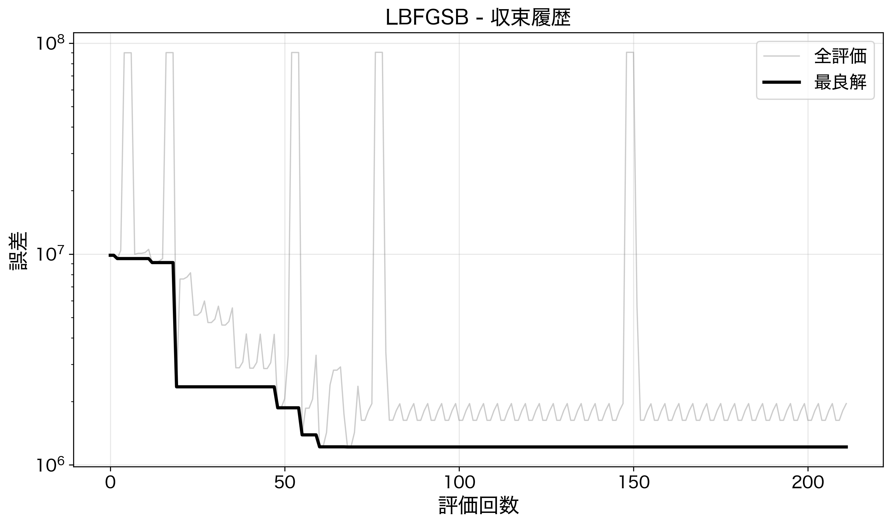

約50回の評価後に10^6程度で局所解に収束。灰色の線に見られるスパイク（10^8付近）は、勾配推定のための有限差分計算によるもの。100回以降は改善が見られず停滞。

#### インピーダンス比較
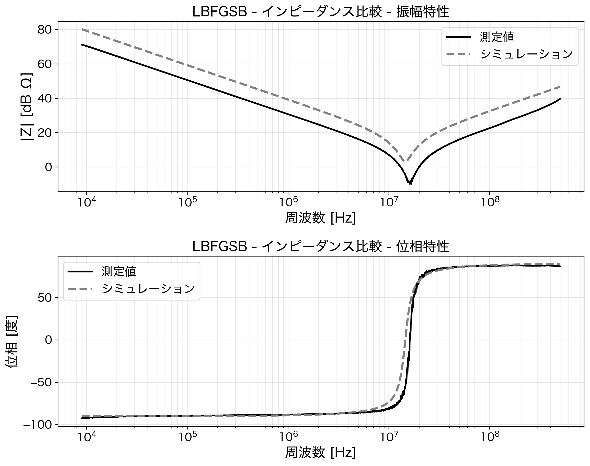

振幅特性に大きなずれがある。特に低周波領域（10^4〜10^6 Hz）で約10dBの差があり、共振周波数も測定値とずれている。

**考察**:
- 勾配ベースの手法のため、局所解に陥りやすい
- 目的関数がシミュレーションベースで非滑らかなため、勾配推定が不正確
- 初期値に強く依存し、良い初期値がないと失敗する
- 滑らかで凸な目的関数には高速だが、本問題には不適

**推奨度**: ★☆☆☆☆（非推奨）

---

### 7. PSO（Particle Swarm Optimization）

**特徴**: 粒子群最適化

**結果**:
- 最小誤差: 1,603,399.09
- 評価回数: 3,000回
- 収束: 不十分（局所解に停滞）

#### 収束履歴
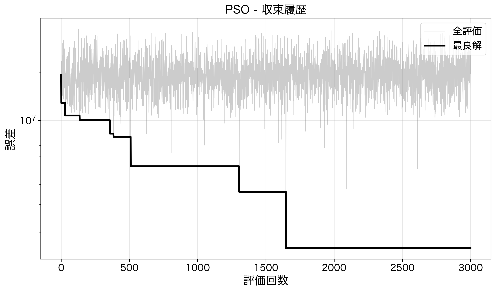

3,000回もの評価を行っても10^6程度に留まっている。灰色の線（全評価）が終始高い値（10^7〜10^8）を維持しており、粒子群全体が良い解の周辺に収束できていない。

#### インピーダンス比較
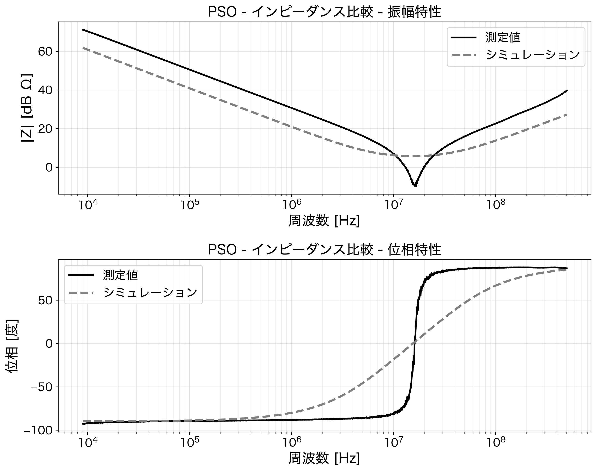

振幅・位相ともに大きなずれがある。低周波で約10dBの差、共振周波数もずれており、位相特性も全周波数帯域で大きな乖離が見られる。

**考察**:
- 粒子の速度と位置の更新による探索
- 本問題では局所解から脱出できず、早期収束の問題が発生
- パラメータ（慣性重み、認知・社会係数）の調整が必要
- 3,000回の評価でも最適解に到達できず、効率が低い
- ハイパーパラメータの最適化が課題

**推奨度**: ★☆☆☆☆（非推奨）

---

## 総合評価と推奨

### 推奨する手法（優先順）

1. **Nelder-Mead法**: 最も効率的で安定した収束。シンプルで実装も容易。
2. **CMA-ES**: Nelder-Meadと同等の性能。より複雑な問題への拡張性が高い。
3. **ベイズ最適化**: 評価回数が制限される場合に有効。

### 推奨しない手法

- **L-BFGS-B**: シミュレーションベースの非滑らかな目的関数には不適
- **PSO**: 本問題ではハイパーパラメータ調整が困難で、収束性が低い

### 結論

RLC等価回路パラメータの最適化には、**Nelder-Mead法**が最も推奨される。
勾配不要で評価回数が少なく、シミュレーションベースの最適化に最適である。
より複雑な回路モデルや高次元パラメータの場合は、**CMA-ES**の使用を検討すべきである。

---

## 最適パラメータ

最終的に得られた最適パラメータ（複数手法で一致）:

| パラメータ | 値 | 単位 |
|------------|-----|------|
| R (等価直列抵抗) | 0.347 | Ω |
| L (等価直列インダクタンス) | 22.05 | nH |
| C (静電容量) | 4.54 | nF |

共振周波数: f₀ = 1/(2π√(LC)) ≈ 15.9 MHz

---

*レポート生成日: 2025年12月11日*
